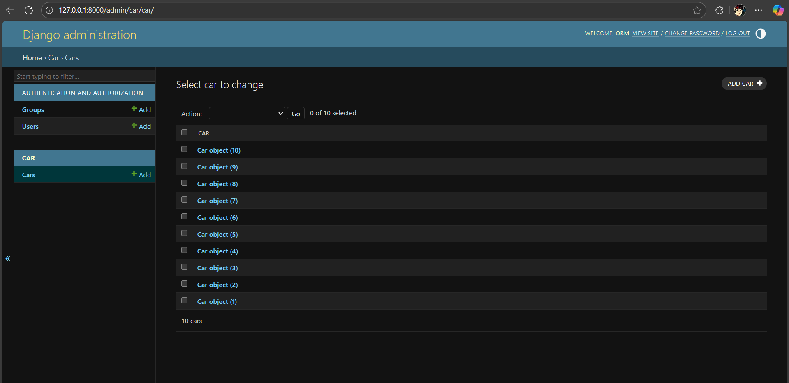

# Ex02 Django ORM Web Application

## Date: 13/09/2025

## AIM

To develop a Django application to store and retrieve data from Car Inventory Database using Object Relational Mapping(ORM).

## ENTITY RELATIONSHIP DIAGRAM

## DESIGN STEPS

### STEP 1:

Clone the problem from GitHub

### STEP 2:

Create a new app in Django project

### STEP 3:

Enter the code for admin.py and models.py

### STEP 4:

Execute Django admin and create details for 10 books

## PROGRAM

admin.py

```python
from django.contrib import admin
from . models import Car
# Register your models here.
admin.site.register(Car)

class CarAdmin(admin.ModelAdmin):
    list_display={'id','model','year','price','type'}
```

models.py

```python
from django.db import models

# Create your models here.
class Car(models.Model):
    id =models.IntegerField(primary_key=True)
    brand = models.CharField(max_length=20)
    model = models.CharField(max_length=50)
    year = models.DateField(auto_now=False, auto_now_add=False)
    price = models.FloatField()
    type = models.CharField(max_length=10)
```

## OUTPUT

Include the screenshot of your admin page.



## RESULT

Thus the program for creating a database using ORM hass been executed successfully
